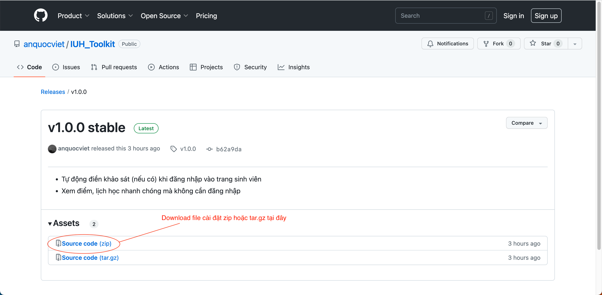
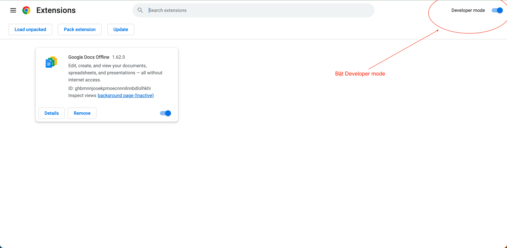
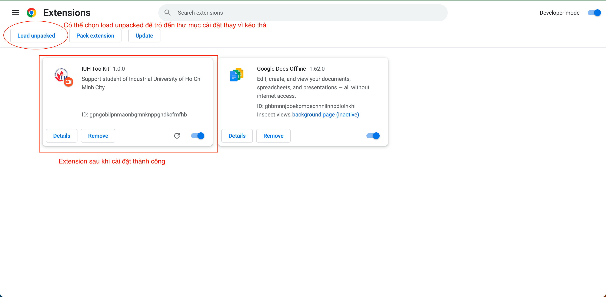
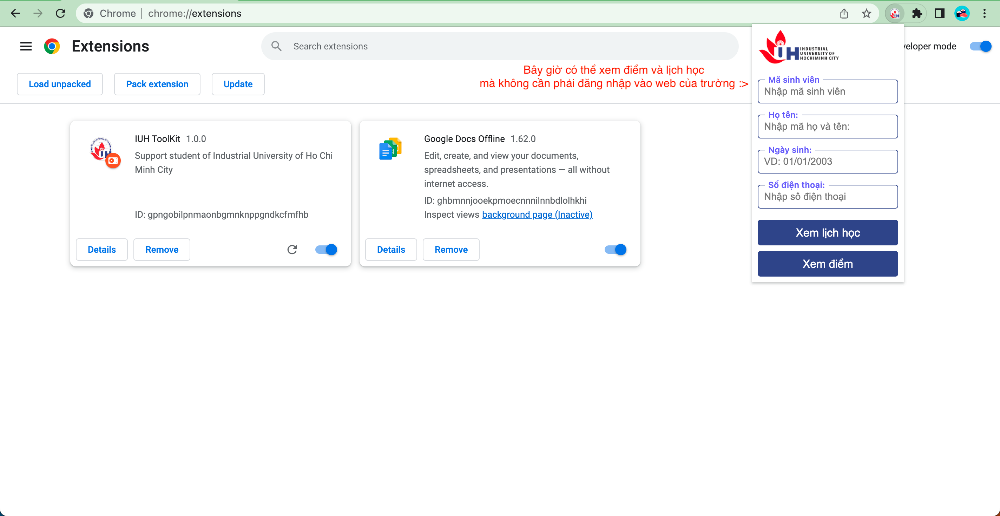

# IUH_Toolkit

Extension hỗ trợ sinh viên IUH thao tác dễ dàng hơn trên hệ thống trang web của trường

-  [Các tính năng](#các-tính-năng)
-  [Cài đặt](#cài-đặt)
   -  [Hướng dẫn cài đặt](#hướng-dẫn-cài-đặt)
-  [Liên hệ](#liên-hệ)

## Các tính năng

-  Tự động điền khảo sát (nếu có) khi đăng nhập vào trang sinh viên
-  Xem điểm, lịch học nhanh chóng mà không cần đăng nhập
   > Chỉ cần nhập mã số sinh viên, họ tên, ngày sinh và số điện thoại 1 lần đầu

## Cài đặt:

-  Extension hỗ trợ trên các trình duyệt có nhân là Chromium: Google Chrome, Microsoft Edge, Cốc Cốc, Opera, Brave,...Vì vậy, nếu bạn sử dụng các trình duyệt như Safari, Firefox,... thì không thể cài đặt được extension này

### Hướng dẫn cài đặt:

1. Download bản mới nhất của extension tại 
   
2. Sau khi tải xuống, mở trình duyệt và vào trang Manage Extension. Sau đó, hãy bật Developer mode (nếu chưa bật) và **reload** lại trang
   
3. Việc đơn giản bây giờ chỉ cần giải nén file cài đặt, kéo thư mục vừa giải nén vào trong trang Manage Extension là thành công việc cài đặt

   > Nếu kéo thư mục vào mà không cài đặt được extension, hãy chọn `Load unpacked` và trỏ đến thư mục đã giải nén

   

4. Sau khi cài đặt thành công, extension sẽ được ẩn ở trên thanh công cụ, nếu cần bạn có thể tìm và ghim nó lên để tiện sử dụng
   

**Lưu ý: vì lấy dữ liệu từ trang dành cho phụ huynh nên khi xem lịch thi không có phần danh sách nhóm thi. Bạn hãy đăng nhập vào hệ thống của trường để xem được đầy đủ nhất nhóm thi**

## Liên hệ:

Nếu trong quá trình sử dụng, bạn có thắc mắc hay mong muốn chức năng cho extension, bạn có thể liên hệ với mình qua [Facebook](https://www.facebook.com/anq.viet203) hoặc thầm kín qua [Telegram](https://t.me/anquocviet) 🥲
